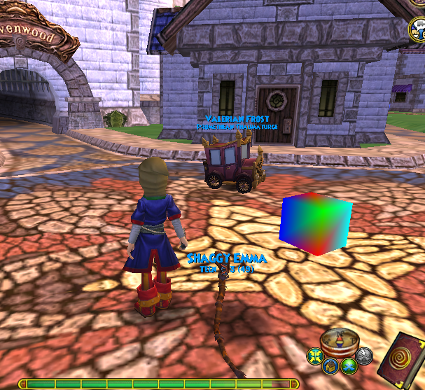
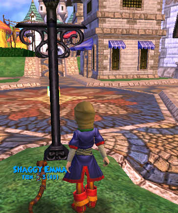

# DX9GraphicsInjection

This was an educational project to learn about dll injection, drawing in a directx9 application within a dll injection, and trampoline hooks. In the spirit of not letting this get used for malicious purposes, I have not included the injector (the code that allocates the dll onto a process), or the Windows Detours library. For the project to compile, it needs the windows detours library and the DirectX9 SDK. 

## How it works

The most interesting part of how this works is how it manages to get a pointer to the directx object being used in the application. Rather than search for it in memory, we can create a temporary instance of the directx9 object and copy it's vtable. Is essentially a list of function pointers that the directx class has listed as virtual. This list of function pointers is used to lookup the location in memory of certain functions. The address of a particular function is used to build a trampoline hook. 

```cpp
/**
* Given the pointer to output the vTable, and the known size of the vTable, this function will copy the contents
*	of the real vTable into the given pointer.
*
* The vTable is basically a list of function pointers. So getting this vTable will give the address of any function we wish to hook for the directx device
*
* This is done by creating a temporary dummy device, and then copying its vTable.
*
* Returns true if successful
*/
bool DX::GetD3D9DeviceVTable(void** vTable, size_t size) {
	if (!vTable)
		return false;

	IDirect3D9* pD3D = Direct3DCreate9(D3D_SDK_VERSION);

	if (!pD3D)
		return false;

	IDirect3DDevice9* pDummyDevice = nullptr;

	D3DPRESENT_PARAMETERS deviceParameters = {};
	deviceParameters.Windowed = false;
	deviceParameters.SwapEffect = D3DSWAPEFFECT_DISCARD;
	deviceParameters.hDeviceWindow = GetProcessWindow();

	//Create a device to get access to the vtable of the d3d9 context (they share the vtable)
	HRESULT dummyDeviceCreated = pD3D->CreateDevice(D3DADAPTER_DEFAULT, D3DDEVTYPE_HAL, deviceParameters.hDeviceWindow, D3DCREATE_SOFTWARE_VERTEXPROCESSING, &deviceParameters, &pDummyDevice);

	if (dummyDeviceCreated != S_OK) {
		deviceParameters.Windowed = !deviceParameters.Windowed;

		//Retry with both windowed and not windowed mode
		HRESULT dummyDeviceCreated = pD3D->CreateDevice(D3DADAPTER_DEFAULT, D3DDEVTYPE_HAL, deviceParameters.hDeviceWindow, D3DCREATE_SOFTWARE_VERTEXPROCESSING, &deviceParameters, &pDummyDevice);
		if (dummyDeviceCreated != S_OK) {
			pD3D->Release();
			return false;
		}
	}

	//Copy the vTable, release the creator and the dummy device
	memcpy(vTable, *(void***)(pDummyDevice), size);
	pDummyDevice->Release();
	pD3D->Release();

	return true;
}
```

A trampoline hook is an assembly-level trick to execute injected code whenever the application calls a certain function, and then continue the original code. (Note: there is no need for this to be on a function, a hook can be placed on any line of code. At the start of the function is the most common use-case). This is done by replacing the first assembly instruction(s), depending on the size of the instruction, with a jump instruction. This jumps will take the Program Counter to the injected DLL code. When the injected DLL function returns, it will jump back to the application's original code where it left off. Originally, I included my own implementation for a trampoline hook for a 32 bit application. However, I ended up using Windows Detours for 64 bit trampoline hooking.

What function do we want to hook? Namely, `EndScene`. This is the function that gets called at the end of drawing a scene. What this will do is hook onto `EndScene` and execute some drawing code before jumping back to the original `EndScene` function. It is there that the cube is drawn. 

However in order to draw in 3d the projection and view matricies are needed. In order to get these, we hook onto the `SetTransform` function of the directx object. This allows us to get a pointer to the *first* view and projection matricies that are set. We copy the first of these matricies because, in most applications, it is common to draw the UI last. UI rendering will use an orthographic projection matrix, which we do not want. Rather, we copy the first projection and view matrix because those are most likely to be the ones used for drawing the scene. 

```cpp
/**
* The idea is to get a pointer to the view and projection matrix by hooking onto the set transform function.
* Whenever the SetTransform function is called, we write down the pointer to the matrix if it is either the view or projection matrix
* We need the view and projection matricies for the shader
*/
void APIENTRY hookSetTransform(LPDIRECT3DDEVICE9 pDevice, D3DTRANSFORMSTATETYPE State, const D3DMATRIX* pMatrix) {
    if (State == D3DTS_VIEW && !viewMatrixSet) {
        viewMatrix = *pMatrix;
        viewMatrixSet = true;
    }
    else if (State == D3DTS_PROJECTION && !projectionMatrixSet) {
        projectionMatrix = *pMatrix;
        projectionMatrixSet = true;
    }

    originalSetTransform(pDevice, State, pMatrix);
}
```

With the directx object, view matrix, and projection matrix, we have the tools needed to draw within the application's 3D environment. To demonstrate, a simple shader and cube are included and drawn at a location in the world. This location will vary depending on the application, and the hard-coded value in the code was just the value that worked for demonstration purposes.

Here is the code (with necessary dependencies) running on an example 64 bit DirectX9 application. This method allows for proper perspective and z-buffering in the 3D environment from a dll injection. 

 
